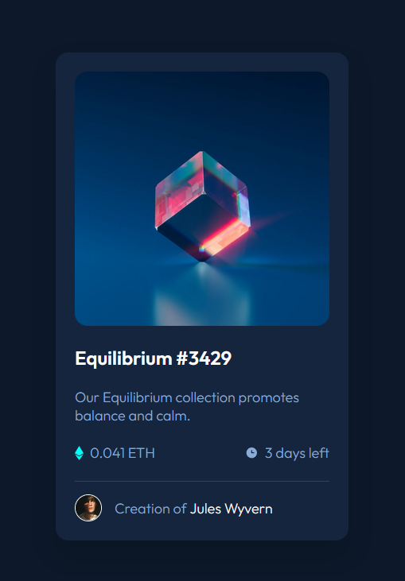

# Frontend Mentor - NFT preview card component solution

Hi there,

This is the solution for my first Frontend Mentor challenge: [NFT preview card component challenge](https://www.frontendmentor.io/challenges/nft-preview-card-component-SbdUL_w0U)

## Table of contents

- [Overview](#overview)
  - [The challenge](#the-challenge)
  - [Screenshot](#screenshot)
  - [Links](#links)
- [My process](#my-process)
  - [Built with](#built-with)
  - [What I learned](#what-i-learned)
- [Author](#author)

## Overview

### The challenge

Users should be able to:

- View the optimal layout depending on their device's screen size
- See hover states for interactive elements

### Screenshot

### Links

- Solution URL: [TBA](https://your-solution-url.com)
- Live Site URL: [TBA](https://your-live-site-url.com)

## My process

### Built with

- Semantic HTML5 markup
- BEM Methodology
- Flexbox
- CSS custom properties

### What I learned

At first, I put the clock and Etherium icons in the markup, which created a mess of CSS classes. I even experimented with separating the meta-information bar into a separate component from a BEM standpoint. When working on the hover effect with the eye icon, I immediately decided to put it in a pseudo-element because it has no real semantic meaning. While taking a break, I realised that this might be the better approach for the other icons, too.

Please let me know if you know of any downsides with loading icons via CSS compared to HTML.

## Author

- Frontend Mentor - [@Jak-Ch-ll](https://www.frontendmentor.io/profile/Jak-Ch-ll)
- Github - [@Jak-Ch-ll](https://github.com/Jak-Ch-ll)
- linkedin - [Jakob Chill](https://www.linkedin.com/in/jakobchill/)
